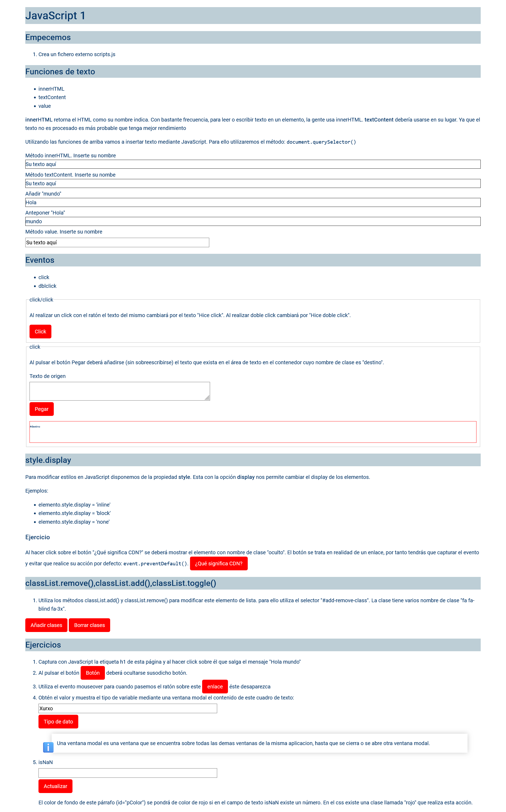

# Ejercicio básico de DOM (Document Object Model)

>[!NOTE]
>Descarga o clona este repositorio y realiza las instrucciones del fichero __index.html__

>[!NOTE]
>Al final de este ejercicio tendrás que comprender los siguientes conceptos:

## Propiedades y métodos

- document.querySelector(elemento)
- elemento.innerHTML
- elemento.textContent
- controlFormulario.value
- elemento.addEventListener(evento, referenciaAFuncion)
  - evento.preventDefault()
  - click
  - dblclick
- elemento.style
  - display
- elemento.classList
  - remove()
  - add()
  - toggle()

## Funciones

### isNaN()

Comprueba is un valor **NO ES UN NÚMERO**

### typeof

Devuelve como **string** el tipo de dato de una variable o literal

>[!WARNING]
>El lunes 18 de diciembre de 2023 se realizará una prueba teórica tipo test para comprobar que realmente se denominan susodichos conceptos. Esta prueba se tendrá en cuenta para la nota final de la **unidad formativa**. Irá acompañada de una prueba práctica que se realizará el miércoles 20 de diciembre de 2023 o el lunes 25 de diciembre de 2023, en función de cómo vaya aprendiendo la clase.